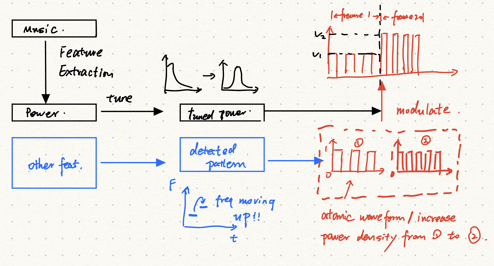

# Vibrations: A Software View

---
## Basics from previous experiments
1. Map feature to the voltage value.
    For now, use the running power of signals.
2. Inteplolating zeros to waveform is essential.
3. With I2C port, 512 samples per frame, 44100 sampling rate, writting 24 values per frame is resaonable.
4. Use power density to control different feelings.

---
## Software View of the Vibrations Coding
**Motivation:**

Minimizing human intervention; maximizing the reusability
1. use combination of atomic waveforms
2. semi-automatic: set rules to assign effects
3. fully-automatic: machine learning involved solution (in the feature)

---
**Bottom Level: Atomic Waveform**
* waveform of one frame (24 values)
* controls the power density by ration of zeros;
* designed to modulate the raw features (1 for raw feature values; 0.5 for half of raw feature values);
* Number of atomic waveform should not be large
*E.g. Design a high zero-ratio waveform for moderate feeling*

---
**Intemedie Level: Multi-frame Effects**
* combination of atomic waveform frame
* based on multiple features
* create a set of rules to "mix" atomic waveform

*E.g with frequency infomation, assiging different atomic waveforms even the power is equivlent*

---

**Top Level: Vibration Mode**
* the "style" of vibration, like the pre-determined equlization effects
* selecting different features
* tuning feature in to global scope.

*E.g. Tuning the distribution of feature values*

---
## Vibrations development process (sketch)

**Stage 1**
Design atomic waveform (can be arbitrary at the begining)
Output: atomic waveform database

**Stage 2**
Determine the features besides power (like frequency); Design multiframe effects based on certain music segment (should not be long)
Output: A set of rules to select different atomic waveform

---

**Stage 3**
Tune the music power on the global level.
Select rules to be applied from the database of stage 2
Output: tunning function database

---

## How does the vibration mode work on real music?

1. Feature extraction
2. Tune the power distribution based on *vibration mode*
3. Apply all rules on the features; detect and assign *multiframe effects*
4. Replace the *effects* with *atomic waveform*
5. Vibration sequence is ready to be send to hardware

---

